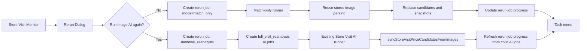

# Store Visit Rerun Async Jobs Implementation Plan

> **For agentic workers:** REQUIRED SUB-SKILL: Use superpowers:subagent-driven-development (recommended) or superpowers:executing-plans to implement this plan task-by-task. Steps use checkbox (`- [ ]`) syntax for tracking.

**Goal:** 在“巡店分析监控”里提供一个 Export-like 的异步重跑入口，默认只重跑商品匹配，也可勾选重新调用图片 AI 解析，并展示总 Visit、完成 Visit、失败 Visit 和失败明细。

**Architecture:** UI 统一入口，后台按 `mode` 分流。`match_only` 走新的 Store Visit rerun job runner，复用已保存图片解析结果重建候选、快照和审核状态；`ai_reanalysis` 复用现有 `store_visit_ai_jobs` 的 `full_visit_reanalysis` 能力，rerun job 只做批量创建、进度聚合和任务菜单展示。匹配规则、AI 解析和任务编排保持解耦，避免一个 job 同时重复替换候选和快照。

**Tech Stack:** Next.js App Router, React client components, Supabase service role, existing `after()` background trigger, existing Store Visit AI jobs, Node test.

---

## 需求理解

当前同步“重跑 Visit 商品匹配”的体验会让页面等待完整流程结束；当一次重跑 2026-07-01 到 2026-07-15 的多条 Visit 时，用户看不到进度和失败明细。

最终交互调整为：

1. 用户仍从“巡店分析监控”发起重跑，不新增独立页面，不加到移动 H5。
2. 弹窗支持单 Visit 或日期范围。
3. 弹窗增加勾选项：`重新调用图片 AI 解析`。
4. 默认不勾选时，只复用已有图片解析结果重跑商品匹配，不调用图片 AI。
5. 勾选时，创建 full visit AI reanalysis 任务，重新跑图片 AI；AI 完成后由现有同步逻辑刷新候选、快照和审核状态。
6. 创建任务后立即返回，用户在任务菜单查看进度。
7. 任务菜单显示：
   - 任务类型：`匹配重跑` / `AI 重解析`
   - 目标范围：单 Visit 或日期范围
   - 总 Visit 数
   - 完成 Visit 数
   - 失败 Visit 数
   - 失败明细：Visit Code / Visit ID / 错误原因

## 核心原则

1. UI 可以合并，底层流程不要硬合并。
2. `match_only` 绝不调用图片 AI。
3. `ai_reanalysis` 不再额外调用 `rerunStoreVisitMatching`，避免 AI job 已经刷新候选后又二次替换。
4. 重跑任务表只记录输入、模式、进度和聚合结果，不保存匹配规则细节。
5. 未来只改 SKU 匹配规则时，不需要改 AI job、任务表和任务菜单。

## 数据设计

### 新表

`store_visit_rerun_jobs`

字段：

- `id uuid primary key default gen_random_uuid()`
- `mode text not null check (mode in ('match_only','ai_reanalysis'))`
- `status text not null check (status in ('queued','running','completed','failed'))`
- `selector jsonb not null`
- `locale text not null default 'zh'`
- `requested_by uuid null`
- `total_visits integer not null default 0`
- `processed_visits integer not null default 0`
- `skipped_visits integer not null default 0`
- `failed_visits integer not null default 0`
- `inserted_candidate_count integer not null default 0`
- `deleted_snapshot_count integer not null default 0`
- `method_counts jsonb not null default '{}'::jsonb`
- `child_ai_jobs jsonb not null default '[]'::jsonb`
- `failures jsonb not null default '[]'::jsonb`
- `error_message text null`
- `started_at timestamptz null`
- `completed_at timestamptz null`
- `created_at timestamptz not null default now()`
- `updated_at timestamptz not null default now()`

`selector` 示例：

```json
{ "visit_id": "..." }
```

```json
{ "date_from": "2026-07-01", "date_to": "2026-07-15" }
```

`child_ai_jobs` 仅用于 `ai_reanalysis`：

```json
[
  { "visitId": "...", "visitCode": "ST202607070005", "jobId": "..." }
]
```

`failures` 示例：

```json
[
  { "visitId": "...", "visitCode": "ST202607070005", "error": "No price images found for this Visit." }
]
```

内测阶段不单独建 failure detail 表；失败明细限制保存前 200 条，`failed_visits` 保留完整计数。

## 数据流



## 文件结构

- Create: `supabase/migrations/202607150003_store_visit_rerun_jobs.sql`
  - 创建统一 rerun job 表、索引和 RLS。
- Modify: `src/lib/types.ts`
  - 增加 `StoreVisitRerunJobMode`、`StoreVisitRerunJobStatus`、`StoreVisitRerunJob`、`StoreVisitRerunJobFailure`。
- Create: `src/lib/store-visit-matching-rerun-gateway.ts`
  - 从当前同步 route 中抽出 Supabase gateway，供同步 API 和异步 runner 复用。
- Modify: `src/lib/store-visit-matching-rerun.ts`
  - 支持按 Visit 进度回调，仍保持匹配规则独立。
- Create: `src/lib/store-visit-rerun-jobs.ts`
  - 统一创建、查询、刷新和运行 rerun jobs。
- Create: `src/app/api/store-visit-monitor/rerun-jobs/route.ts`
  - 创建任务、列出最近任务。
- Create: `src/app/api/store-visit-monitor/rerun-jobs/[jobId]/route.ts`
  - 查询单个任务并刷新 AI 模式聚合进度。
- Create: `src/app/api/internal/store-visit-monitor/rerun-jobs/run/route.ts`
  - internal runner，校验 `CRON_SECRET` 或 admin。
- Modify: `src/app/api/store-visit-monitor/rerun-matching/route.ts`
  - 保留同步兼容 API，但复用抽出的 gateway。
- Modify: `src/components/store-visit-matching-rerun-dialog.tsx`
  - 弹窗改为异步提交，并增加“重新调用图片 AI 解析”勾选。
- Create: `src/components/store-visit-rerun-job-menu.tsx`
  - 展示任务列表、进度和失败明细。
- Modify: `src/components/store-visit-monitor-client.tsx`
  - 在巡店分析监控工具区放置任务菜单，触发弹窗成功后刷新任务菜单。
- Test: `tests/store-visit-rerun-jobs.test.ts`
- Test: `tests/store-visit-rerun-route.test.mjs`
- Test: `tests/store-visit-matching-rerun.test.ts`

---

## Task 1: 数据库迁移

**Files:**

- Create: `supabase/migrations/202607150003_store_visit_rerun_jobs.sql`
- Test: `tests/store-visit-rerun-jobs.test.ts`

- [ ] **Step 1: 写迁移文件**

```sql
create table if not exists public.store_visit_rerun_jobs (
  id uuid primary key default gen_random_uuid(),
  mode text not null check (mode in ('match_only','ai_reanalysis')),
  status text not null default 'queued' check (status in ('queued','running','completed','failed')),
  selector jsonb not null,
  locale text not null default 'zh',
  requested_by uuid null,
  total_visits integer not null default 0,
  processed_visits integer not null default 0,
  skipped_visits integer not null default 0,
  failed_visits integer not null default 0,
  inserted_candidate_count integer not null default 0,
  deleted_snapshot_count integer not null default 0,
  method_counts jsonb not null default '{}'::jsonb,
  child_ai_jobs jsonb not null default '[]'::jsonb,
  failures jsonb not null default '[]'::jsonb,
  error_message text null,
  started_at timestamptz null,
  completed_at timestamptz null,
  created_at timestamptz not null default now(),
  updated_at timestamptz not null default now()
);

create index if not exists idx_store_visit_rerun_jobs_requested_created
  on public.store_visit_rerun_jobs (requested_by, created_at desc);

create index if not exists idx_store_visit_rerun_jobs_status_created
  on public.store_visit_rerun_jobs (status, created_at);

alter table public.store_visit_rerun_jobs enable row level security;

drop policy if exists "store_visit_rerun_jobs_select_own" on public.store_visit_rerun_jobs;
create policy "store_visit_rerun_jobs_select_own"
  on public.store_visit_rerun_jobs
  for select
  using (auth.uid() = requested_by);
```

- [ ] **Step 2: 写迁移结构测试**

在 `tests/store-visit-rerun-jobs.test.ts` 增加：

```ts
import { readFileSync } from "node:fs";
import test from "node:test";
import assert from "node:assert/strict";

const migration = readFileSync("supabase/migrations/202607150003_store_visit_rerun_jobs.sql", "utf8");

test("store visit rerun jobs migration supports match-only and AI reanalysis modes", () => {
  assert.match(migration, /store_visit_rerun_jobs/);
  assert.match(migration, /mode text not null/);
  assert.match(migration, /match_only/);
  assert.match(migration, /ai_reanalysis/);
  assert.match(migration, /child_ai_jobs jsonb/);
  assert.match(migration, /failures jsonb/);
  assert.match(migration, /enable row level security/i);
});
```

- [ ] **Step 3: 运行测试，确认通过**

Run:

```bash
node --test tests/store-visit-rerun-jobs.test.ts
```

Expected: PASS。

## Task 2: 类型定义

**Files:**

- Modify: `src/lib/types.ts`
- Test: `tests/store-visit-rerun-jobs.test.ts`

- [ ] **Step 1: 写类型测试**

在 `tests/store-visit-rerun-jobs.test.ts` 增加：

```ts
const typesFile = readFileSync("src/lib/types.ts", "utf8");

test("store visit rerun job types expose mode status and failure records", () => {
  assert.match(typesFile, /export type StoreVisitRerunJobMode = "match_only" \| "ai_reanalysis"/);
  assert.match(typesFile, /export type StoreVisitRerunJobStatus = "queued" \| "running" \| "completed" \| "failed"/);
  assert.match(typesFile, /export type StoreVisitRerunJobFailure/);
  assert.match(typesFile, /export type StoreVisitRerunJob/);
  assert.match(typesFile, /child_ai_jobs/);
});
```

- [ ] **Step 2: 实现类型**

在 `src/lib/types.ts` 增加：

```ts
export type StoreVisitRerunJobMode = "match_only" | "ai_reanalysis";
export type StoreVisitRerunJobStatus = "queued" | "running" | "completed" | "failed";

export type StoreVisitRerunJobFailure = {
  visitId: string;
  visitCode: string | null;
  error: string;
};

export type StoreVisitRerunChildAiJob = {
  visitId: string;
  visitCode: string | null;
  jobId: string;
};

export type StoreVisitRerunJob = {
  id: string;
  mode: StoreVisitRerunJobMode;
  status: StoreVisitRerunJobStatus;
  selector: Record<string, unknown>;
  locale: string;
  requested_by: string | null;
  total_visits: number;
  processed_visits: number;
  skipped_visits: number;
  failed_visits: number;
  inserted_candidate_count: number;
  deleted_snapshot_count: number;
  method_counts: Record<string, number>;
  child_ai_jobs: StoreVisitRerunChildAiJob[];
  failures: StoreVisitRerunJobFailure[];
  error_message: string | null;
  started_at: string | null;
  completed_at: string | null;
  created_at: string;
  updated_at: string;
};
```

- [ ] **Step 3: 运行测试**

Run:

```bash
node --test tests/store-visit-rerun-jobs.test.ts
```

Expected: PASS。

## Task 3: 抽出匹配重跑 gateway

**Files:**

- Create: `src/lib/store-visit-matching-rerun-gateway.ts`
- Modify: `src/app/api/store-visit-monitor/rerun-matching/route.ts`
- Test: `tests/store-visit-matching-rerun-route.test.mjs`

- [ ] **Step 1: 写 route 架构测试**

在 `tests/store-visit-matching-rerun-route.test.mjs` 增加：

```js
import { readFileSync } from "node:fs";
import test from "node:test";
import assert from "node:assert/strict";

const route = readFileSync("src/app/api/store-visit-monitor/rerun-matching/route.ts", "utf8");
const gateway = readFileSync("src/lib/store-visit-matching-rerun-gateway.ts", "utf8");

test("sync matching rerun route reuses shared gateway", () => {
  assert.match(route, /createStoreVisitMatchingRerunGateway/);
  assert.doesNotMatch(route, /function createGateway/);
  assert.match(gateway, /export function createStoreVisitMatchingRerunGateway/);
  assert.match(gateway, /replaceCandidates/);
  assert.match(gateway, /triggerReview/);
});
```

- [ ] **Step 2: 创建 gateway 文件**

创建 `src/lib/store-visit-matching-rerun-gateway.ts`，从当前 `src/app/api/store-visit-monitor/rerun-matching/route.ts` 原样移动这些已经可运行的 Supabase 访问函数：

- `createGateway`
- `selectVisits`
- 查询已保存解析结果的函数
- 替换候选记录的函数
- 刷新 Visit 存储价格状态的函数
- 触发现有自动审核的函数

移动后把导出函数命名为：

```ts
export function createStoreVisitMatchingRerunGateway(
  supabase: SupabaseServiceClient,
): StoreVisitMatchingRerunGateway
```

`createStoreVisitMatchingRerunGateway` 返回值必须继续满足 `StoreVisitMatchingRerunGateway`，包括：

```ts
{
  selectVisits,
  loadVisionRows,
  replaceCandidates,
  refreshStoredPriceState,
  triggerReview,
}
```

- [ ] **Step 3: 修改同步 route**

`src/app/api/store-visit-monitor/rerun-matching/route.ts` 中只保留认证、读 body 和调用：

```ts
const result = await rerunStoreVisitMatching(
  body,
  createStoreVisitMatchingRerunGateway(supabase),
);
```

- [ ] **Step 4: 运行测试**

Run:

```bash
node --test tests/store-visit-matching-rerun-route.test.mjs tests/store-visit-matching-rerun.test.ts
```

Expected: PASS。

## Task 4: 匹配重跑进度回调

**Files:**

- Modify: `src/lib/store-visit-matching-rerun.ts`
- Test: `tests/store-visit-matching-rerun.test.ts`

- [ ] **Step 1: 写进度回调测试**

在 `tests/store-visit-matching-rerun.test.ts` 增加：

```ts
test("matching rerun reports progress after each visit without changing final result", async () => {
  const progress: Array<{ processedVisitCount: number; failedVisitCount: number }> = [];
  const result = await rerunStoreVisitMatching(
    { date_from: "2026-07-01", date_to: "2026-07-15" },
    fakeGatewayWithTwoVisits(),
    {
      onVisitProgress(snapshot) {
        progress.push({
          processedVisitCount: snapshot.processedVisitCount,
          failedVisitCount: snapshot.failedVisitCount,
        });
      },
    },
  );

  assert.equal(result.selectedVisitCount, 2);
  assert.deepEqual(progress.map((item) => item.processedVisitCount), [1, 2]);
});
```

如果当前测试 helper 名称不同，使用文件中已有 fake gateway helper 改成两个 Visit 的版本。

- [ ] **Step 2: 修改函数签名**

在 `src/lib/store-visit-matching-rerun.ts` 增加：

```ts
export type StoreVisitMatchingRerunProgress = StoreVisitMatchingRerunResult;

export type StoreVisitMatchingRerunOptions = {
  onVisitProgress?: (progress: StoreVisitMatchingRerunProgress) => void | Promise<void>;
};
```

把函数签名改为：

```ts
export async function rerunStoreVisitMatching(
  request: unknown,
  gateway: StoreVisitMatchingRerunGateway,
  options: StoreVisitMatchingRerunOptions = {},
): Promise<StoreVisitMatchingRerunResult> {
```

- [ ] **Step 3: 每个 Visit 完成后回调**

在每个 Visit 成功、跳过或失败后执行：

```ts
await options.onVisitProgress?.({ ...result });
```

不要改变现有返回结构。

- [ ] **Step 4: 运行测试**

Run:

```bash
node --test tests/store-visit-matching-rerun.test.ts
```

Expected: PASS。

## Task 5: 统一 rerun job service

**Files:**

- Create: `src/lib/store-visit-rerun-jobs.ts`
- Test: `tests/store-visit-rerun-jobs.test.ts`

- [ ] **Step 1: 写 service 架构测试**

在 `tests/store-visit-rerun-jobs.test.ts` 增加：

```ts
const serviceFile = readFileSync("src/lib/store-visit-rerun-jobs.ts", "utf8");

test("store visit rerun job service separates match-only and AI reanalysis execution", () => {
  assert.match(serviceFile, /export async function createStoreVisitRerunJob/);
  assert.match(serviceFile, /export async function listStoreVisitRerunJobs/);
  assert.match(serviceFile, /export async function runStoreVisitRerunJob/);
  assert.match(serviceFile, /export async function refreshStoreVisitRerunJobProgress/);
  assert.match(serviceFile, /mode === "match_only"/);
  assert.match(serviceFile, /mode === "ai_reanalysis"/);
  assert.match(serviceFile, /createStoreVisitAiJob/);
  assert.match(serviceFile, /triggerStoreVisitAiJobRunner/);
  assert.doesNotMatch(serviceFile, /rerunStoreVisitMatching[\s\S]*mode === "ai_reanalysis"/);
});
```

- [ ] **Step 2: 实现创建和列表函数**

`src/lib/store-visit-rerun-jobs.ts` 导出：

```ts
export type CreateStoreVisitRerunJobInput = {
  mode: StoreVisitRerunJobMode;
  selector: StoreVisitMatchingRerunSelector;
  locale: string;
  requestedBy: string | null;
  requestUrl: string;
};

export async function createStoreVisitRerunJob(input: CreateStoreVisitRerunJobInput) {
  const supabase = createSupabaseServiceClient();
  const { data, error } = await supabase
    .from("store_visit_rerun_jobs")
    .insert({
      mode: input.mode,
      selector: input.selector,
      locale: input.locale,
      requested_by: input.requestedBy,
      status: "queued",
    })
    .select("*")
    .single();
  if (error || !data) throw new Error(error?.message ?? "Failed to create rerun job");
  await triggerStoreVisitRerunJobRunner({ requestUrl: input.requestUrl, jobId: data.id });
  return data as StoreVisitRerunJob;
}

export async function listStoreVisitRerunJobs(input: { requestedBy: string | null; limit?: number }) {
  const supabase = createSupabaseServiceClient();
  let query = supabase
    .from("store_visit_rerun_jobs")
    .select("*")
    .order("created_at", { ascending: false })
    .limit(input.limit ?? 10);
  if (input.requestedBy) query = query.eq("requested_by", input.requestedBy);
  const { data, error } = await query;
  if (error) throw new Error(error.message);
  const jobs = (data ?? []) as StoreVisitRerunJob[];
  return Promise.all(jobs.map((job) => refreshStoreVisitRerunJobProgress({ job })));
}
```

- [ ] **Step 3: 实现 match-only runner 分支**

`runStoreVisitRerunJob` 中：

```ts
if (job.mode === "match_only") {
  const gateway = createStoreVisitMatchingRerunGateway(supabase);
  await markJobRunning(supabase, job.id);
  const result = await rerunStoreVisitMatching(job.selector, gateway, {
    async onVisitProgress(progress) {
      await updateJobFromMatchingProgress(supabase, job.id, progress);
    },
  });
  return completeJobFromMatchingResult(supabase, job.id, result);
}
```

- [ ] **Step 4: 实现 AI reanalysis 创建分支**

`runStoreVisitRerunJob` 中：

```ts
if (job.mode === "ai_reanalysis") {
  await markJobRunning(supabase, job.id);
  const visits = await selectRerunVisits(supabase, job.selector);
  const childAiJobs: StoreVisitRerunChildAiJob[] = [];
  const failures: StoreVisitRerunJobFailure[] = [];

  for (const visit of visits) {
    try {
      const imageIds = await loadActivePriceImageIds(supabase, visit.id);
      if (imageIds.length === 0) throw new Error("No active price images found for this Visit.");
      const created = await createStoreVisitAiJob({
        visitId: visit.id,
        jobType: "full_visit_reanalysis",
        imageIds,
        requestSnapshot: {
          source: "store_visit_monitor_rerun",
          parent_rerun_job_id: job.id,
          selector: job.selector,
        },
        supabase,
      });
      childAiJobs.push({ visitId: visit.id, visitCode: visit.visit_code ?? null, jobId: created.job.id });
    } catch (error) {
      failures.push({
        visitId: visit.id,
        visitCode: visit.visit_code ?? null,
        error: error instanceof Error ? error.message : String(error),
      });
    }
  }

  await updateJobWithChildAiJobs(supabase, job.id, visits.length, childAiJobs, failures);
  await triggerStoreVisitAiJobRunner({ requestUrl: jobRequestUrl(job), jobId: null });
  return refreshStoreVisitRerunJobProgress({ jobId: job.id, supabase });
}
```

`jobRequestUrl(job)` 可以使用创建 job 时传给 runner 的 request URL；如果不保存 request URL，则在 API runner 中调用 `triggerStoreVisitAiJobRunner({ requestUrl: request.url, jobId: null })`。

- [ ] **Step 5: 实现 AI reanalysis 聚合进度**

`refreshStoreVisitRerunJobProgress` 对 `ai_reanalysis`：

```ts
const childJobs = job.child_ai_jobs;
const aiJobIds = childJobs.map((item) => item.jobId);
const { data: aiJobs, error } = await supabase
  .from("store_visit_ai_jobs")
  .select("id,status,success_count,failed_count,retake_required_count,remaining_count")
  .in("id", aiJobIds);
if (error) throw new Error(error.message);

const aiJobById = new Map((aiJobs ?? []).map((item) => [String(item.id), item]));
const completed = childJobs.filter((child) => {
  const aiJob = aiJobById.get(child.jobId);
  return aiJob?.status === "completed";
});
const failed = childJobs.filter((child) => {
  const aiJob = aiJobById.get(child.jobId);
  return aiJob?.status === "failed";
});

const status = childJobs.length > 0 && completed.length + failed.length >= childJobs.length
  ? "completed"
  : "running";
```

`processed_visits = completed.length + failed.length + initialCreationFailures.length`。

- [ ] **Step 6: 运行测试**

Run:

```bash
node --test tests/store-visit-rerun-jobs.test.ts
```

Expected: PASS。

## Task 6: API

**Files:**

- Create: `src/app/api/store-visit-monitor/rerun-jobs/route.ts`
- Create: `src/app/api/store-visit-monitor/rerun-jobs/[jobId]/route.ts`
- Create: `src/app/api/internal/store-visit-monitor/rerun-jobs/run/route.ts`
- Test: `tests/store-visit-rerun-route.test.mjs`

- [ ] **Step 1: 写 API 测试**

在 `tests/store-visit-rerun-route.test.mjs` 增加：

```js
import { readFileSync } from "node:fs";
import test from "node:test";
import assert from "node:assert/strict";

const jobsRoute = readFileSync("src/app/api/store-visit-monitor/rerun-jobs/route.ts", "utf8");
const jobRoute = readFileSync("src/app/api/store-visit-monitor/rerun-jobs/[jobId]/route.ts", "utf8");
const runRoute = readFileSync("src/app/api/internal/store-visit-monitor/rerun-jobs/run/route.ts", "utf8");

test("store visit rerun job APIs create list load and run jobs", () => {
  assert.match(jobsRoute, /export async function POST/);
  assert.match(jobsRoute, /export async function GET/);
  assert.match(jobsRoute, /mode/);
  assert.match(jobsRoute, /createStoreVisitRerunJob/);
  assert.match(jobRoute, /refreshStoreVisitRerunJobProgress/);
  assert.match(runRoute, /CRON_SECRET/);
  assert.match(runRoute, /runStoreVisitRerunJob/);
});
```

- [ ] **Step 2: 实现 POST / GET**

`src/app/api/store-visit-monitor/rerun-jobs/route.ts`：

```ts
export async function POST(request: Request) {
  const auth = await requireAdminSession(request);
  if (auth.response) return auth.response;
  const { body } = await readRequestBody(request);
  const mode = body.mode === "ai_reanalysis" ? "ai_reanalysis" : "match_only";
  const selector = normalizeMatchingRerunRequest(body);
  const job = await createStoreVisitRerunJob({
    mode,
    selector,
    locale: String(body.locale ?? "zh"),
    requestedBy: auth.user?.id ?? null,
    requestUrl: request.url,
  });
  return Response.json({ job });
}

export async function GET(request: Request) {
  const auth = await requireAdminSession(request);
  if (auth.response) return auth.response;
  const jobs = await listStoreVisitRerunJobs({
    requestedBy: auth.user?.id ?? null,
    limit: 10,
  });
  return Response.json({ jobs });
}
```

- [ ] **Step 3: 实现单 job GET**

`src/app/api/store-visit-monitor/rerun-jobs/[jobId]/route.ts`：

```ts
export async function GET(request: Request, ctx: { params: Promise<{ jobId: string }> }) {
  const auth = await requireAdminSession(request);
  if (auth.response) return auth.response;
  const { jobId } = await ctx.params;
  const job = await refreshStoreVisitRerunJobProgress({ jobId });
  return Response.json({ job });
}
```

- [ ] **Step 4: 实现 internal runner**

`src/app/api/internal/store-visit-monitor/rerun-jobs/run/route.ts`：

```ts
export const dynamic = "force-dynamic";
export const maxDuration = 300;

export async function POST(request: Request) {
  const authResponse = await requireCronSecretOrAdmin(request);
  if (authResponse) return authResponse;
  const { body } = await readRequestBody(request).catch(() => ({ body: {} }));
  const jobId = String((body as Record<string, unknown>).job_id ?? "").trim();
  const result = await runStoreVisitRerunJob({
    jobId: jobId || null,
    requestUrl: request.url,
  });
  return Response.json(result);
}
```

- [ ] **Step 5: 运行测试**

Run:

```bash
node --test tests/store-visit-rerun-route.test.mjs
```

Expected: PASS。

## Task 7: 弹窗改为异步双模式

**Files:**

- Modify: `src/components/store-visit-matching-rerun-dialog.tsx`
- Test: `tests/store-visit-rerun-route.test.mjs`

- [ ] **Step 1: 写 UI 源码断言**

在 `tests/store-visit-rerun-route.test.mjs` 增加：

```js
const dialog = readFileSync("src/components/store-visit-matching-rerun-dialog.tsx", "utf8");

test("rerun dialog supports async match-only and AI reanalysis modes", () => {
  assert.match(dialog, /runAiAnalysis/);
  assert.match(dialog, /重新调用图片 AI 解析/);
  assert.match(dialog, /mode: runAiAnalysis \? "ai_reanalysis" : "match_only"/);
  assert.match(dialog, /\/api\/store-visit-monitor\/rerun-jobs/);
  assert.match(dialog, /任务已创建/);
  assert.doesNotMatch(dialog, /\/api\/store-visit-monitor\/rerun-matching"/);
});
```

- [ ] **Step 2: 修改 state 和提交 body**

在弹窗组件里增加：

```tsx
const [runAiAnalysis, setRunAiAnalysis] = useState(false);
```

提交 body 改为：

```ts
const body = target.kind === "visit"
  ? { visit_id: target.visitId, mode: runAiAnalysis ? "ai_reanalysis" : "match_only", locale }
  : { date_from: dateFrom, date_to: dateTo, mode: runAiAnalysis ? "ai_reanalysis" : "match_only", locale };
```

请求地址改为：

```ts
const response = await fetch("/api/store-visit-monitor/rerun-jobs", {
  method: "POST",
  headers: { "Content-Type": "application/json" },
  body: JSON.stringify(body),
});
```

- [ ] **Step 3: 增加勾选 UI 和文案**

在日期/Visit 范围下方加入：

```tsx
<label className="mt-4 flex items-start gap-2 rounded-md border border-slate-200 bg-slate-50 px-3 py-2 text-sm text-slate-700">
  <input
    type="checkbox"
    className="mt-1"
    checked={runAiAnalysis}
    onChange={(event) => setRunAiAnalysis(event.target.checked)}
  />
  <span>
    <span className="block font-medium text-slate-900">
      {isZh ? "重新调用图片 AI 解析" : "Run image AI again"}
    </span>
    <span className="mt-1 block text-xs leading-5 text-slate-500">
      {isZh
        ? "不勾选时只复用已有解析结果重跑 SKU 匹配；勾选后会重新解析图片，耗时更长并产生 AI 调用。"
        : "Unchecked reuses stored parsing results for SKU matching only. Checked reruns image AI, takes longer, and creates AI calls."}
    </span>
  </span>
</label>
```

- [ ] **Step 4: 修改成功态文案**

成功后显示：

```tsx
{isZh
  ? "任务已创建，可在右上角任务菜单查看进度。"
  : "Job created. Check progress from the task menu."}
```

按钮文案：

```tsx
{status === "submitting"
  ? (isZh ? "创建任务中..." : "Creating job...")
  : runAiAnalysis
    ? (isZh ? "创建 AI 重解析任务" : "Create AI reanalysis job")
    : (isZh ? "创建匹配重跑任务" : "Create matching rerun job")}
```

- [ ] **Step 5: 运行测试**

Run:

```bash
node --test tests/store-visit-rerun-route.test.mjs
```

Expected: PASS。

## Task 8: 任务菜单

**Files:**

- Create: `src/components/store-visit-rerun-job-menu.tsx`
- Modify: `src/components/store-visit-monitor-client.tsx`
- Test: `tests/store-visit-rerun-route.test.mjs`

- [ ] **Step 1: 写 UI 测试**

在 `tests/store-visit-rerun-route.test.mjs` 增加：

```js
const menu = readFileSync("src/components/store-visit-rerun-job-menu.tsx", "utf8");
const monitorClient = readFileSync("src/components/store-visit-monitor-client.tsx", "utf8");

test("store visit monitor exposes rerun job menu with progress and failures", () => {
  assert.match(menu, /StoreVisitRerunJobMenu/);
  assert.match(menu, /\/api\/store-visit-monitor\/rerun-jobs/);
  assert.match(menu, /processed_visits/);
  assert.match(menu, /failed_visits/);
  assert.match(menu, /failures/);
  assert.match(menu, /match_only/);
  assert.match(menu, /ai_reanalysis/);
  assert.match(monitorClient, /StoreVisitRerunJobMenu/);
});
```

- [ ] **Step 2: 实现菜单组件**

组件状态：

```tsx
const [open, setOpen] = useState(false);
const [jobs, setJobs] = useState<StoreVisitRerunJob[]>([]);
const [loading, setLoading] = useState(false);
```

加载函数：

```tsx
async function loadJobs() {
  setLoading(true);
  try {
    const response = await fetch("/api/store-visit-monitor/rerun-jobs", { cache: "no-store" });
    const payload = await response.json().catch(() => ({}));
    if (!response.ok) throw new Error(payload.error ?? "Failed to load rerun jobs");
    setJobs(Array.isArray(payload.jobs) ? payload.jobs : []);
  } finally {
    setLoading(false);
  }
}
```

轮询规则：

```tsx
useEffect(() => {
  if (!open) return;
  const hasActiveJob = jobs.some((job) => job.status === "queued" || job.status === "running");
  if (!hasActiveJob) return;
  const timer = window.setInterval(() => void loadJobs(), 10000);
  return () => window.clearInterval(timer);
}, [open, jobs]);
```

展示内容：

```tsx
<div>{job.mode === "ai_reanalysis" ? "AI 重解析" : "匹配重跑"}</div>
<div>完成 {job.processed_visits} / {job.total_visits}</div>
<div>失败 {job.failed_visits}</div>
```

失败明细展示前 10 条：

```tsx
{job.failures.slice(0, 10).map((failure) => (
  <li key={`${job.id}-${failure.visitId}`}>
    {failure.visitCode ?? failure.visitId}: {failure.error}
  </li>
))}
```

- [ ] **Step 3: 接入巡店分析监控**

在 `src/components/store-visit-monitor-client.tsx` 工具区加入：

```tsx
<StoreVisitRerunJobMenu locale={locale} />
```

弹窗提交成功后调用菜单刷新，可以通过给 menu 加 `refreshSignal` prop 或在成功后触发 `router.refresh()`。优先使用 `refreshSignal`，避免整页刷新。

- [ ] **Step 4: 运行测试**

Run:

```bash
node --test tests/store-visit-rerun-route.test.mjs
```

Expected: PASS。

## Task 9: 验证和回归

**Files:**

- Test: `tests/store-visit-rerun-jobs.test.ts`
- Test: `tests/store-visit-rerun-route.test.mjs`
- Test: `tests/store-visit-matching-rerun.test.ts`
- Test: `tests/product-match-engine.test.ts`
- Test: `tests/product-match-rules-v2.test.ts`

- [ ] **Step 1: 跑新 rerun job 测试**

Run:

```bash
node --test tests/store-visit-rerun-jobs.test.ts tests/store-visit-rerun-route.test.mjs
```

Expected: PASS。

- [ ] **Step 2: 跑匹配规则回归**

Run:

```bash
node --test tests/product-match-engine.test.ts tests/product-match-rules-v2.test.ts tests/store-visit-matching-rerun.test.ts
```

Expected: PASS。

- [ ] **Step 3: 跑相关 lint 和类型检查**

Run:

```bash
npx eslint src/lib/store-visit-rerun-jobs.ts src/components/store-visit-matching-rerun-dialog.tsx src/components/store-visit-rerun-job-menu.tsx tests/store-visit-rerun-jobs.test.ts tests/store-visit-rerun-route.test.mjs
npx tsc --noEmit --pretty false
```

Expected: both commands exit 0。

- [ ] **Step 4: 本地手动验收**

在 `localhost:3000` 打开巡店分析监控：

1. 对单个 Visit 创建默认匹配重跑任务。
2. 确认弹窗立即返回，不等待完整重跑结束。
3. 打开任务菜单，确认显示 `匹配重跑`、总数、完成数、失败数。
4. 对日期范围创建默认匹配重跑任务。
5. 勾选 `重新调用图片 AI 解析` 后创建任务。
6. 确认任务菜单显示 `AI 重解析`。
7. 确认 AI 模式产生 `full_visit_reanalysis` 子任务。
8. 确认 AI 模式完成后 H5 详情展示新解析后的候选和匹配 SKU。
9. 确认默认匹配重跑模式没有创建 `store_visit_ai_jobs`。

## 验收标准

1. 发起任务后页面不再等待整个重跑完成。
2. 默认模式只重跑商品匹配，不调用图片 AI。
3. 勾选 `重新调用图片 AI 解析` 时，创建 full visit AI reanalysis 任务。
4. AI 重解析完成后不再额外执行 match-only 重跑，避免候选和快照二次替换。
5. 单 Visit 和日期范围都支持两种模式。
6. 任务菜单能看到最近任务、任务类型、总 Visit、完成 Visit、失败 Visit 和失败明细。
7. H5 详情读取重跑后的候选、快照和匹配 SKU。
8. 匹配规则未来小改不需要修改任务表、任务菜单和 AI job runner。

## 不做的事情

1. 不新增独立页面。
2. 不加到移动 H5。
3. 不做通用任务中心。
4. 不做任务暂停、取消、优先级。
5. 不把匹配规则写进任务表。
6. 不让一个 job 同时执行 AI 重解析和 match-only 重跑。
7. 不单独建立失败明细表，除非后续失败记录明显超过 JSON 字段承载。

## 自审结论

该计划把用户入口合并为一个弹窗和一个任务菜单，但保留 `match_only` 与 `ai_reanalysis` 两条底层流程。这样能满足“只是一个勾选”的产品体验，同时避免把图片 AI、SKU 匹配规则、候选替换和快照刷新揉成一个难维护流程。实现难度比原异步匹配重跑略高，主要增加 AI 模式的批量创建和进度聚合；不会显著改变现有 AI job 机制。
